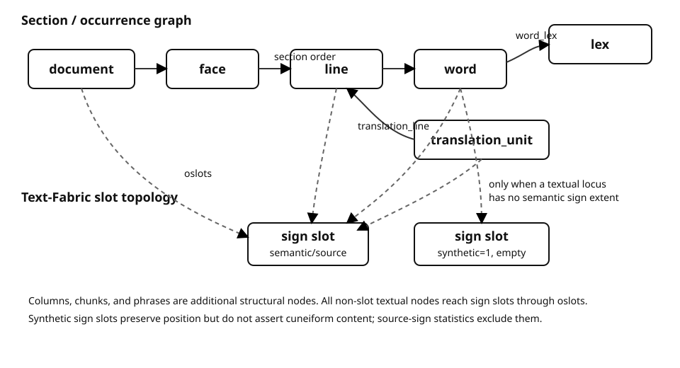

# Data model

ORACC-TF uses `sign` as the Text-Fabric slot type. The corpus distinguishes
semantic source signs from technical empty slots required to preserve
independently positioned zero-span textual entities.



## Graph overview

The main textual hierarchy is `document → face → line → word → sign`. ORACC
source `d` markers are encountered as a flat event stream during conversion;
the section walker turns that stream into explicit TF `document`, `face`,
`column`, and `line` nodes without pretending that the original JSON was
already a nested section tree. `chunk` and `phrase` nodes preserve additional
source structure.

Text-Fabric's warp edge `oslots` connects every non-slot textual node to the
`sign` slots that make up its extent. The generated
[`otype` reference](features/mixed/otype.md) is the authoritative current
node-count table, and the generated
[`oslots` reference](features/edge/oslots.md) reports the current warp
connectivity. Keeping those counts generated avoids maintaining a second
hand-typed census here.

Two non-warp relations are especially important for researchers:

- `word_lex` connects a word occurrence to one or more canonical `lex`
  nodes. It is many-to-many at corpus scale; see
  [Words and lexemes](words-and-lexemes.md).
- `translation_line` connects each aligned `translation_unit` to every
  source `line` explicitly covered by its TEI range; see
  [Translations](translations.md).

The qualified `document_key` is propagated across relevant nodes so that
cross-node and external joins do not collapse same-Q documents from different
subprojects. See [Document identity](identity.md).

## Empty textual positions

The normative rule is
[ADR-0001](architecture/ADR-0001-empty-slots-not-sidecars.md): zero-span
textual entities stay in the normal TF graph through explicit `synthetic=1`
empty `sign` slots. Such slots preserve source order only; they carry no
fabricated `utf8`, `readingu`, `sign_json`, grapheme, token, or lexical
content. Ancestor sections reuse descendant anchors instead of receiving
redundant synthetic slots.

Whole-corpus measurement for RIAO + RINAP after issue #37:

- semantic/source signs: **792,651**;
- synthetic empty slots: **689**;
- total TF slots: **793,340**;
- source words / TF word nodes: **320,975 / 320,975**;
- source documents / TF document nodes: **2,078 / 2,078**;
- zero-span sidecar nodes in new builds: **0**.

Unicode coverage remains **778,873 / 792,651 (98.2618%)** because synthetic
slots are excluded from semantic-sign statistics.

The `synthetic` feature also occurs on a small number of synthesized
structural nodes, so “nodes with `synthetic=1`” and “synthetic sign slots” are
not interchangeable counts. Use `otype == "sign"` when counting technical
empty slots.

`zero-span.json` is a legacy-reader format only. Current builds do not emit
it for textual zero-span entities.

## Practical traversal

A line's TF slots are available through the normal locality API, while explicit
semantic relations use their named edges. For example:

```python
line = api.F.otype.s("line")[0]
slots = api.L.d(line, otype="sign")
words = api.L.d(line, otype="word")

lexemes = {
    lex
    for word in words
    for lex in api.E.word_lex.f(word)
}
translations = api.E.translation_line.t(line)
```

The last expression retrieves translation units whose explicit source range
includes the line. It is not a per-line translation field.
